---
tags:
  - Infra
  - CMDB
  - Server
  - Ansible
---
---
> [info]
> 본 프로젝트는 Linux 환경에서 동작 하도록 구성되어있습니다.
> Ubuntu 환경 기준으로 작성되었습니다.

---
---
## 00. Diagram

```mermaid
flowchart TD

subgraph IDC_Server["IDC"]

direction TB

IS1["물리서버 다발"]

end

subgraph s2["CMDB Server"]

direction TB

CMDB1["make_cmdb_list.sh"]

n14["csv_custom.tpl"]

n13["all_cmdb_update.yml"]

n12["make_overview.sh"]

n15["Server List CSV"]

n17["all_update_upload.yml"]

end

subgraph s1["Google SDK Code"]

direction LR

UP1["all_cmdb_upload.yml"]

n6["01.file_upload.py"]

n7["02.file_filter.py"]

n8["03.copy_rack_temp.py"]

n9["04.copy_data_sheet.py"]

end

subgraph CMDB_Upload["Google Drive"]

direction TB

UP2["날짜 별 Data Sheet"]

n2["Rack 상면 Sheet"]

n3["App Scripts"]

end

subgraph CMDB_Update["Mysql DB"]

direction TB

n4["cmdb_view.py"]

UPD1["cmdb_update.py"]

n11["cmdb_clean.py"]

end

subgraph CMDB_View["NGINX"]

direction TB

VIEW2["var/www/html/cmoon"]

end

CMDB1 --> n14

n14 --> n15

n15 <--> UP1

UP1 --> n6 & n7 & n8 & n9

n6 --> UP2

n7 --> UP2

n8 --> n2

n9 ==> UP2

UP2 ==> n2

n2 --> n3

n13 --> n12

n12 --> CMDB_View

n17 --> n13 & UP1

CMDB_Update <--> s2

IDC_Server --> s2

  

style IS1 fill:#000000,stroke:#000000,stroke-width:2px,color:#FFFFFF

style CMDB1 fill:#000000,color:#FFFFFF

style n14 fill:#000000

style n13 fill:#000000

style n12 fill:#000000

style n15 color:#FFFFFF,fill:#2962FF

style n17 fill:#000000,color:#FFFFFF

style UP1 fill:#000000,color:#000000

style n6 fill:#000000

style n7 fill:#000000

style n8 fill:#000000

style n9 fill:#000000

style UP2 color:#FFFFFF,fill:#2962FF

style n2 stroke:#000000,fill:#2962FF,color:#FFFFFF

style n3 fill:#000000,color:#FFFFFF

style n4 fill:#000000

style UPD1 fill:#000000

style n11 fill:#000000,stroke:#000000

style VIEW2 fill:#2962FF,color:#FFFFFF

style CMDB_View fill:#E1BEE7,stroke:none,stroke-width:2px

style CMDB_Update fill:#E1BEE7,stroke:none,stroke-width:2px

style s2 fill:#757575,stroke:none,color:#FFFFFF

style IDC_Server fill:#757575,color:#FFFFFF

style CMDB_Upload fill:#BBDEFB,stroke:none,stroke-width:2px,color:#000000

style s1 fill:#BBDEFB,stroke:none,color:#000000

click CMDB1 "https://github.com/Luminous-Flame/C-Moon/blob/main/scripts/make_cmdb_list.sh"

click n14 "https://github.com/Luminous-Flame/C-Moon/blob/main/tpl/csv_custom.tpl"

click n13 "https://github.com/Luminous-Flame/C-Moon/blob/main/scripts/all_cmdb_update.yml"

click n12 "https://github.com/Luminous-Flame/C-Moon/blob/main/scripts/make_overview.sh"

click n17 "https://github.com/Luminous-Flame/C-Moon/blob/main/scripts/all_update_upload.yml"

click UP1 "https://github.com/Luminous-Flame/C-Moon/blob/main/scripts/all_cmdb_upload.yml"

click n6 "https://github.com/Luminous-Flame/C-Moon/blob/main/scripts/file_upload.py"

click n7 "https://github.com/Luminous-Flame/C-Moon/blob/main/scripts/copy_data_sheet.py"

click n8 "https://github.com/Luminous-Flame/C-Moon/blob/main/scripts/copy_rack_temp.py"

click n9 "https://github.com/Luminous-Flame/C-Moon/blob/main/scripts/file_filter.py"

click n3 "https://script.google.com/macros/s/AKfycbzH7Vd1YT6IqXNSVbCCwzLOIQ1U4dvLiY1IXzqlcw_GuiOOM-H_fSz1_6BPpRrPQ0fSqw/exec"

click n4 "https://github.com/Luminous-Flame/C-Moon/blob/main/scripts/cmdb_view.py"

click UPD1 "https://github.com/Luminous-Flame/C-Moon/blob/main/scripts/cmdb_update.py"

click n11 "https://github.com/Luminous-Flame/C-Moon/blob/main/scripts/cmdb_clean.py"

linkStyle 4 stroke:#000000,fill:none

linkStyle 5 stroke:#000000,fill:none

linkStyle 7 stroke:#000000,fill:none

linkStyle 9 stroke:#000000,fill:none

linkStyle 10 stroke:#D50000,fill:none

linkStyle 11 stroke:#D50000,fill:none
```

---
## 01. Ansible CMDB
  

---
## 02. MYSQL
  

---
## 03. Python

- 데이터베이스를 생성하여 원시 데이터를 입력하고, 필요에 따라 조회 할 수 있습니다.

  

  

---
## 04. Google Drive Spread Sheet

- 가공 된 데이터를 통해 좀 더 쉽게 **ISMS 자산 관리 대장** 갱신 및 **관련 작업 시, 유연한 문서 작업**을 위해 Google Drive에 업로드